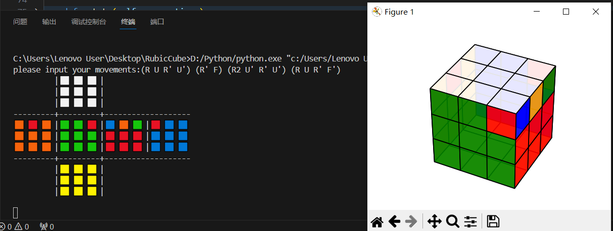

# Rubic's Cube Simulator
Here is a easy project written by python. It can sumulate playing Rubic's Cube.

By inputing movements, u can get expansion diagram and stereogram of Rubik's cube. Like example.png!

To be done in the future:
1. Supports the repetition of some formulas. e.g:(R U R' U')2.   Done!
2. Realization of Rubik's cube blind coding generation. (The reduction method is: 魔方小站 version. https://www.bilibili.com/video/BV1Ye4y1b7e)
3. Implement the animation process

If this project is useful for u, plz give me a star :)
